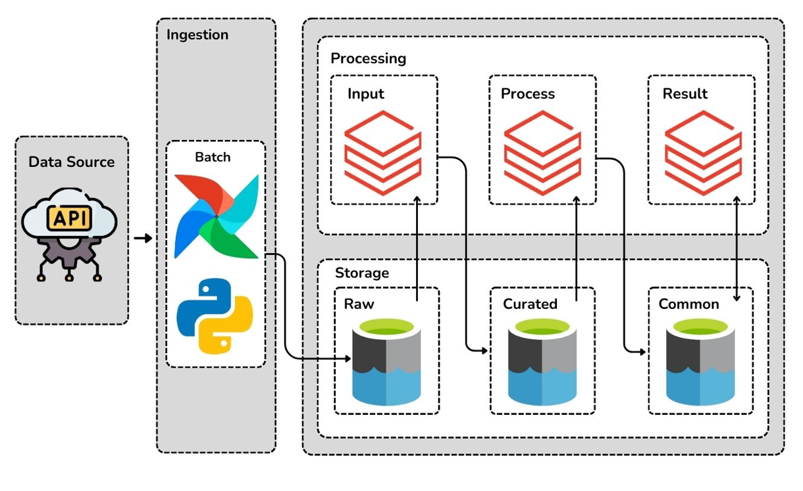
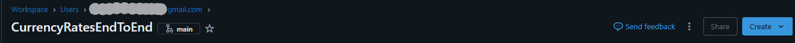
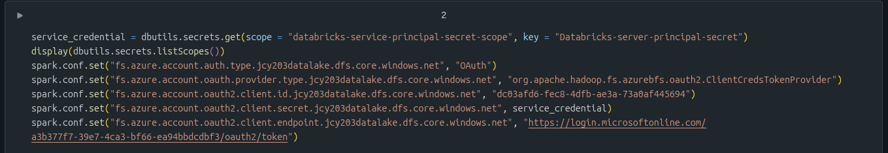
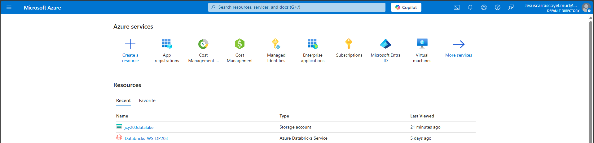

# Arquitectura del Proyecto

# Aquí voy a explicar las dificultades y pasos clave a seguir al realizar el proyecto.

# Extracción 

## Script 
Para la realización del script me he apoyado en la documentación oficial de Microsoft ->[Microsoft Learn Datalake Service Client](https://learn.microsoft.com/en-us/python/api/overview/azure/storage-file-datalake-readme?view=azure-python),
en mi caso el script hace una petición a la [API Exange Rate](https://www.exchangerate-api.com/). y se encarga de la subida a la capa **raw**.

# Transformación

## Databricks
He decidido trabajar con Databricks, desde mi repositorio, para esto desde añado la carpeta git 
a databricks, pudiendo trabajar desde la UI de Databricks en mi repo.

## Permisos en DataBricks
### Para manejar el acceso de Databricks al DataLake he seguido los siguientes pasos:

1. Crear un **service principal**.
2. Añadir al grupo de acceso a DataLake con rol de **Storage Blob Data Contributor**.
3. Crear secreto en key vault.
4. Añadir a un **secret-scope** de databricks el secreto.
5. Conectar desde el nootebook usando el método de conexión de **service-principal**.

# Carga
La carga de datos al nivel **raw** es realizada por el script, a los niveles **curated** y **common** los datos son cargados por los cuadernos de databricks tras realizar las transformaciones.

# Orquestación

## Airflow
### Para la orquestación del proyecto he usado airflow, al ser un proyecto de práctica he decidido desplegarlo con **Astro CLI**
Astro CLI facilita la el proceso de instalación y configuración de los componentes de airflow, que no son parte del alcance que quería para este proyecto.

Dejo la docu de **[Astro CLI](https://www.astronomer.io/docs/astro/cli/overview).** en la que me he apoyado.

La orquestación realizada por **airflow**, es la siguiente: diariamente mandamos la ejecución de un script que realiza la petición, otro que realiza la subida a raw, a partir de este paso, utilizando **DatabricksSubmitRunOperator** realizamos la ejecución de los scripts de transformación de raw a common en nootebooks de databricks, pronto haré otro proyecto con el enfoque de jobs en databricks.

Para que **airflow** pueda acceder a databricks utilizo las conections de airflow, establecidas en el fichero de configuración (que no está en github).

## Dar acceso a mi app para interactuar con el DataLake

1. Accede al [portal de Azure](https://portal.azure.com/).
2. Navega al **Storage Account** deseado.
3. En el menú lateral, selecciona **Control de acceso (IAM)**.
4. Haz clic en **Agregar** > **Agregar asignación de rol**.
5. Elige el rol adecuado (por ejemplo, *Storage Blob Data Contributor*).
6. En **Asignar acceso a**, selecciona **Usuario, grupo o entidad de servicio**.
7. Busca y selecciona la **App Registration** correspondiente.
8. Haz clic en **Revisar y asignar** para finalizar.

Esto otorga a la App Registration los permisos necesarios sobre el Storage Account.

# Cloud Provider
## Azure
Por parte de **Azure** los servicios que he usado son [Azure Databricks](https://azure.microsoft.com/es-es/products/databricks/?msockid=292b80f2ffe061eb1aaf9552fe0b60a1)., [Azure DataLake 2Gen](https://learn.microsoft.com/en-us/azure/storage/blobs/data-lake-storage-introduction). y [Azure Key Vault](https://learn.microsoft.com/es-es/azure/key-vault/general/overview).

