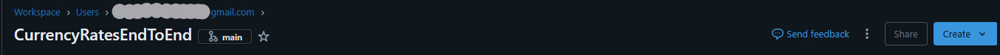

# Aquí voy a explicar las dificultades y pasos clave a seguir al realizar el proyecto.

## Script 
· Para la realización del script me he apoyado en la documentación oficial de Microsoft ->[Microsoft Learn Datalake Service Client](https://learn.microsoft.com/en-us/python/api/overview/azure/storage-file-datalake-readme?view=azure-python).
## Dar acceso a mi app para interactuar con el DataLake

1. Accede al [portal de Azure](https://portal.azure.com/).
2. Navega al **Storage Account** deseado.
3. En el menú lateral, selecciona **Control de acceso (IAM)**.
4. Haz clic en **Agregar** > **Agregar asignación de rol**.
5. Elige el rol adecuado (por ejemplo, *Storage Blob Data Contributor*).
6. En **Asignar acceso a**, selecciona **Usuario, grupo o entidad de servicio**.
7. Busca y selecciona la **App Registration** correspondiente.
8. Haz clic en **Revisar y asignar** para finalizar.

Esto otorga a la App Registration los permisos necesarios sobre el Storage Account.

# Trabajar con Databricks
He decidido trabajar con Databricks, desde mi repositorio, para esto desde añado la carpeta git 
a databricks, pudiendo trabajar desde la UI de Databricks en mi repo.

## Permisos en DataBricks
Para asignar permisos a Databricks en mi DataLake he seguido los siguientes pasos:

1. Accede al portal de Azure.
2. Navega al recurso Azure Databricks que vas a usar.
3. En el menú izquierdo, selecciona Identidad administrada (Managed Identity).
4. Habilita la opción Identidad asignada por el sistema y guarda los cambios.
5. Navega ahora al Storage Account (ADLS Gen2) que contiene tu Data Lake.
6. En el menú lateral, selecciona Control de acceso (IAM).
7. Haz clic en Agregar > Agregar asignación de rol.
8. Selecciona el rol Storage Blob Data Reader (si solo necesitas lectura) o Storage Blob Data Contributor (si necesitas escribir).
9. En Asignar acceso a, elige Entidad de servicio administrada.
10. Busca y selecciona el recurso Azure Databricks con Managed Identity habilitada.

